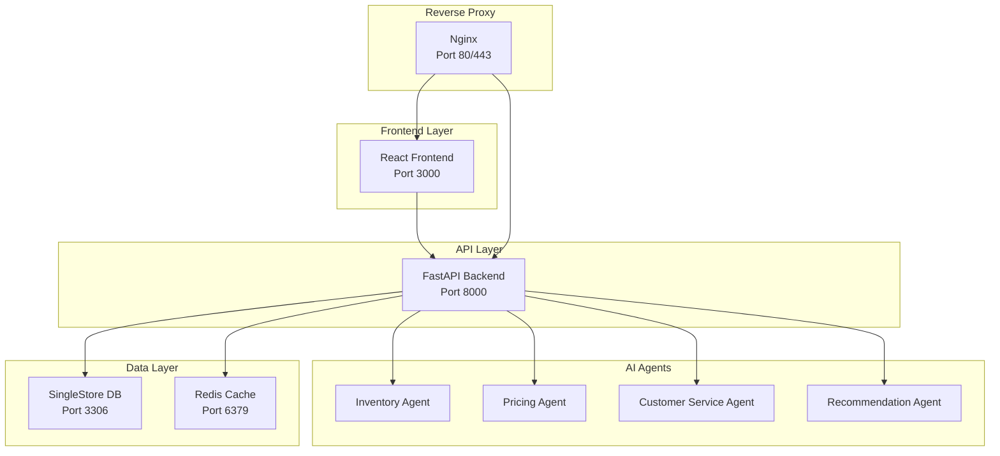

# AI-Powered Ecommerce Platform - Deployment Guide

## 🚀 Quick Start

### Prerequisites
- Docker and Docker Compose installed
- OpenAI API key (optional, for full AI functionality)
- Minimum 4GB RAM and 10GB disk space

### 1. Clone and Setup
```bash
# Make setup script executable (Linux/Mac)
chmod +x scripts/setup.sh

# Run automated setup
./scripts/setup.sh
```

### 2. Manual Setup (Alternative)
```bash
# Start services
docker-compose up -d --build

# Wait for services to be ready (about 2-3 minutes)
docker-compose logs -f

# Initialize database and create sample data
docker-compose exec backend python scripts/create_sample_data.py
```

### 3. Access the Platform
- **Frontend**: http://localhost:3000
- **Backend API**: http://localhost:8000
- **API Documentation**: http://localhost:8000/docs
- **SingleStore Studio**: http://localhost:8080

### 4. Default Credentials
- **Admin**: admin@example.com / admin123
- **User**: user@example.com / user123

## 🏗️ Architecture Overview



## 🤖 AI Agents Overview

### 1. Inventory Management Agent
- **Purpose**: Automated stock management and demand prediction
- **Features**:
  - Real-time stock level monitoring
  - Demand forecasting using historical data
  - Automatic reordering for low-stock items
  - Seasonal pattern analysis
- **API Endpoint**: `/api/agents/inventory/check-stock`

### 2. Pricing Optimization Agent
- **Purpose**: Dynamic pricing based on market conditions
- **Features**:
  - Price elasticity calculation
  - Market condition analysis
  - Competitor price monitoring (simulated)
  - Automatic price adjustments
- **API Endpoint**: `/api/agents/pricing/optimize`

### 3. Customer Service Agent
- **Purpose**: Automated customer support and inquiry handling
- **Features**:
  - Natural language processing for customer queries
  - Automated response generation
  - Ticket prioritization and escalation
  - Sentiment analysis
- **API Endpoint**: `/api/agents/customer-service/handle-inquiry`

### 4. Recommendation Agent
- **Purpose**: Personalized product recommendations
- **Features**:
  - Collaborative filtering
  - Content-based filtering
  - AI-powered recommendations using OpenAI
  - Cross-selling opportunities
- **API Endpoint**: `/api/agents/recommendations/generate`

## 🔧 Configuration

### Environment Variables
Create a `.env` file in the project root:

```bash
# Database Configuration
SINGLESTORE_HOST=singlestore
SINGLESTORE_PORT=3306
SINGLESTORE_USER=root
SINGLESTORE_PASSWORD=
SINGLESTORE_DATABASE=ecommerce_ai

# API Configuration
SECRET_KEY=your-secret-key-change-in-production
OPENAI_API_KEY=your-openai-api-key

# Agent Configuration
ENABLE_AUTO_PRICING=true
ENABLE_AUTO_INVENTORY=true
ENABLE_AUTO_RECOMMENDATIONS=true
PRICE_UPDATE_INTERVAL=3600
INVENTORY_CHECK_INTERVAL=1800

# Frontend Configuration
REACT_APP_API_URL=http://localhost:8000
```

### Agent Configuration
Agents can be controlled via the admin panel at `/admin/agents` or through API endpoints:

```bash
# Activate an agent
curl -X POST http://localhost:8000/api/agents/activate/InventoryAgent

# Execute an agent manually
curl -X POST http://localhost:8000/api/agents/execute/PricingAgent

# Get agent status
curl http://localhost:8000/api/agents/status
```

## 🔄 Automated Operations

### Background Tasks
The platform runs several automated tasks:

1. **Agent Execution**: Every 30 minutes, all active agents execute automatically
2. **Inventory Monitoring**: Continuous monitoring of stock levels
3. **Price Updates**: Hourly price optimization checks
4. **Recommendation Updates**: Daily recommendation model updates

### Manual Triggers
You can manually trigger agent operations:

```bash
# Execute all agents
curl -X POST http://localhost:8000/api/agents/execute-all

# Execute specific agent with context
curl -X POST http://localhost:8000/api/agents/execute/InventoryAgent \
  -H "Content-Type: application/json" \
  -d '{"auto_execute": true, "manual_trigger": true}'
```

## 📊 Monitoring and Analytics

### Admin Dashboard
Access comprehensive analytics at `/admin`:
- Revenue and sales metrics
- AI agent performance
- Inventory status
- Customer service metrics
- Real-time system status

### Health Checks
- **Backend**: http://localhost:8000/health
- **Frontend**: http://localhost:3000/health
- **Database**: Automatic health checks in Docker Compose

### Logs
```bash
# View all service logs
docker-compose logs -f

# View specific service logs
docker-compose logs -f backend
docker-compose logs -f frontend
docker-compose logs -f singlestore
```

## 🔒 Security Features

### Authentication & Authorization
- JWT-based authentication
- Role-based access control (Admin/User)
- Protected API endpoints
- Secure password hashing

### Security Headers
- CORS protection
- XSS protection
- Content Security Policy
- Rate limiting on API endpoints

## 🚀 Production Deployment

### 1. SSL Configuration
Update `nginx/nginx.conf` to enable HTTPS:
```bash
# Generate SSL certificates (Let's Encrypt recommended)
certbot certonly --webroot -w /var/www/certbot -d your-domain.com

# Update nginx configuration with SSL settings
# Restart services
docker-compose restart nginx
```

### 2. Environment Security
```bash
# Generate secure secret key
openssl rand -hex 32

# Use environment-specific configurations
cp .env.example .env.production
# Update with production values
```

### 3. Database Backup
```bash
# Create database backup
docker-compose exec singlestore mysqldump -u root ecommerce_ai > backup.sql

# Restore from backup
docker-compose exec -T singlestore mysql -u root ecommerce_ai < backup.sql
```

## 🛠️ Troubleshooting

### Common Issues

1. **Services not starting**
   ```bash
   # Check Docker resources
   docker system df
   docker system prune
   
   # Rebuild services
   docker-compose down
   docker-compose up -d --build
   ```

2. **Database connection issues**
   ```bash
   # Check SingleStore status
   docker-compose exec singlestore mysql -u root -e "SELECT 1"
   
   # Reset database
   docker-compose down -v
   docker-compose up -d
   ```

3. **AI agents not working**
   - Ensure OpenAI API key is set in `.env`
   - Check agent status: `/api/agents/status`
   - Review logs: `docker-compose logs backend`

### Performance Optimization

1. **Database Optimization**
   - Monitor query performance in SingleStore Studio
   - Add indexes for frequently queried columns
   - Use connection pooling

2. **Caching**
   - Redis is configured for session and data caching
   - Enable browser caching for static assets
   - Use CDN for production deployments

3. **Scaling**
   ```bash
   # Scale backend services
   docker-compose up -d --scale backend=3
   
   # Use load balancer (nginx configuration)
   # Add multiple upstream servers
   ```

## 📈 Monitoring and Maintenance

### Regular Tasks
- Monitor disk usage and logs
- Update dependencies regularly
- Backup database weekly
- Review AI agent performance
- Monitor API rate limits

### Metrics Collection
The platform provides built-in analytics:
- Sales and revenue tracking
- User behavior analysis
- AI agent performance metrics
- System resource utilization

## 🆘 Support

### Logs and Debugging
```bash
# Enable debug logging
export LOG_LEVEL=DEBUG
docker-compose restart backend

# Access container shells
docker-compose exec backend bash
docker-compose exec singlestore mysql -u root

# View real-time agent activity
curl http://localhost:8000/api/agents/logs/InventoryAgent
```

### Health Status
Monitor system health through:
- `/health` endpoints
- Docker health checks
- Agent status dashboard
- Database connection status

For additional support, check the logs and ensure all services are running correctly.
