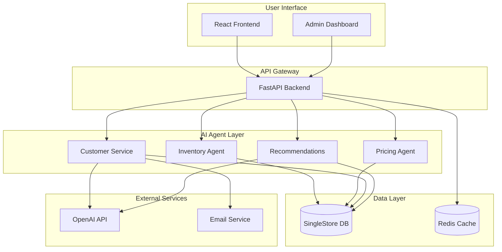

# 🤖 AI-Powered Ecommerce Platform

A fully autonomous ecommerce platform that runs entirely with AI agents, featuring intelligent inventory management, dynamic pricing, automated customer service, and personalized recommendations.

## ✨ Key Features

### 🎯 Fully Automated Operations
- **Zero-touch inventory management** with predictive restocking
- **Dynamic pricing optimization** based on real-time market conditions
- **Autonomous customer service** with AI-powered response generation
- **Intelligent product recommendations** using collaborative and content-based filtering
- **Automated order processing** and fulfillment coordination

### 🧠 AI Agent System
- **4 Specialized AI Agents** working in coordination
- **Real-time decision making** with continuous learning
- **Autonomous execution** with human oversight capabilities
- **Performance monitoring** and optimization
- **Scalable agent architecture** for future expansion

### 🏗️ Modern Tech Stack
- **Database**: SingleStore (high-performance distributed SQL)
- **Backend**: Python FastAPI with async support
- **Frontend**: React with TypeScript and Tailwind CSS
- **AI/ML**: OpenAI GPT integration with custom algorithms
- **Deployment**: Docker with container orchestration
- **Caching**: Redis for high-performance data access

## 🚀 Quick Start

### Prerequisites
- Docker and Docker Compose
- OpenAI API key (optional, for full AI functionality)
- 4GB RAM minimum

### One-Command Setup
```bash
# Clone the repository
git clone <repository-url>
cd company

# Run automated setup
./scripts/setup.sh
```

### Manual Setup
```bash
# Start all services
docker-compose up -d --build

# Initialize database with sample data
docker-compose exec backend python scripts/create_sample_data.py
```

### Access Points
- **🌐 Frontend**: http://localhost:3000
- **🔧 Backend API**: http://localhost:8000
- **📚 API Docs**: http://localhost:8000/docs
- **🗄️ Database Studio**: http://localhost:8080

### Default Login
- **Admin**: admin@example.com / admin123
- **User**: user@example.com / user123

## 🤖 AI Agents Overview

### 📦 Inventory Management Agent
- Monitors stock levels across all products
- Predicts demand using historical sales data
- Automatically reorders products when stock is low
- Analyzes seasonal patterns and trends
- Optimizes stock levels to minimize holding costs

### 💰 Pricing Optimization Agent  
- Calculates price elasticity for each product
- Monitors market conditions and competitor pricing
- Automatically adjusts prices to maximize revenue
- Considers inventory levels and demand forecasts
- Maintains minimum profit margins

### 🎧 Customer Service Agent
- Processes customer inquiries automatically
- Generates contextual responses using AI
- Escalates complex issues to human agents
- Tracks customer satisfaction metrics
- Handles returns, refunds, and support tickets

### 🎯 Recommendation Agent
- Provides personalized product suggestions
- Uses collaborative and content-based filtering
- Analyzes user behavior and purchase history
- Identifies cross-selling opportunities
- Continuously improves recommendation accuracy

## 🏛️ System Architecture



## 📊 Real-Time Dashboard

The admin dashboard provides comprehensive insights:

- **📈 Sales Analytics**: Revenue trends, order metrics, conversion rates
- **🤖 AI Performance**: Agent execution status, success rates, response times
- **📦 Inventory Status**: Stock levels, reorder alerts, demand forecasts
- **👥 Customer Insights**: User behavior, satisfaction scores, support metrics
- **💡 AI Recommendations**: Performance metrics, click-through rates, conversion impact

## 🔧 Configuration

### Environment Setup
```bash
# Core Configuration
SINGLESTORE_HOST=singlestore
OPENAI_API_KEY=your-openai-key

# Agent Settings
ENABLE_AUTO_PRICING=true
ENABLE_AUTO_INVENTORY=true
PRICE_UPDATE_INTERVAL=3600
INVENTORY_CHECK_INTERVAL=1800
```

### Agent Control
```bash
# Execute all agents
curl -X POST http://localhost:8000/api/agents/execute-all

# Control individual agents
curl -X POST http://localhost:8000/api/agents/activate/InventoryAgent
curl -X POST http://localhost:8000/api/agents/execute/PricingAgent

# Monitor agent status
curl http://localhost:8000/api/agents/status
```

## 🔄 Automated Operations

### Background Processes
- **Agent Execution**: Every 30 minutes
- **Inventory Monitoring**: Continuous real-time monitoring  
- **Price Updates**: Hourly optimization cycles
- **Recommendation Updates**: Daily model retraining
- **Performance Analytics**: Real-time metric collection

### Manual Overrides
All automated processes can be manually triggered or overridden through the admin interface or API endpoints.

## 🚀 Production Deployment

### Docker Compose Production
```bash
# Production deployment with SSL
docker-compose --profile production up -d

# Scale backend services
docker-compose up -d --scale backend=3
```

### Key Production Features
- **SSL/TLS encryption** with automatic certificate renewal
- **Load balancing** with Nginx reverse proxy
- **Rate limiting** and DDoS protection
- **Database replication** and automated backups
- **Health monitoring** and alerting
- **Log aggregation** and analysis

## 📚 Documentation

- **[Deployment Guide](DEPLOYMENT.md)**: Comprehensive setup and deployment instructions
- **[API Documentation](http://localhost:8000/docs)**: Interactive API explorer
- **[Agent Architecture](docs/agents.md)**: Detailed AI agent documentation
- **[Database Schema](docs/database.md)**: Complete data model reference

## 🧪 Sample Data

The platform includes realistic sample data:
- **6 Product categories** with diverse inventory
- **Multiple user accounts** with different roles
- **Historical sales data** for AI training
- **Sample customer interactions** for service agent testing

## 🔒 Security Features

- **JWT authentication** with role-based access control
- **API rate limiting** to prevent abuse
- **Input validation** and SQL injection protection
- **CORS configuration** for secure cross-origin requests
- **Security headers** and XSS protection
- **Encrypted password storage** with bcrypt hashing

## 🎯 Use Cases

### E-commerce Businesses
- Reduce operational overhead with automation
- Optimize pricing strategies in real-time
- Improve customer satisfaction with AI support
- Increase sales through intelligent recommendations

### Technology Demonstrations
- Showcase AI agent coordination
- Demonstrate real-time decision making
- Illustrate modern web architecture
- Highlight database performance at scale

### Educational Purposes  
- Learn AI agent development patterns
- Understand microservices architecture
- Explore modern web development practices
- Study database optimization techniques

## 🤝 Contributing

This is a proof-of-concept demonstration. For production use, consider:
- Enhanced security measures
- Comprehensive testing coverage
- Performance optimization
- Monitoring and alerting systems
- Data privacy compliance

## 📄 License

This project is for educational and demonstration purposes. Please ensure compliance with all applicable licenses and terms of service for integrated services (OpenAI, etc.).

---

**🎉 Experience the future of autonomous ecommerce today!**
